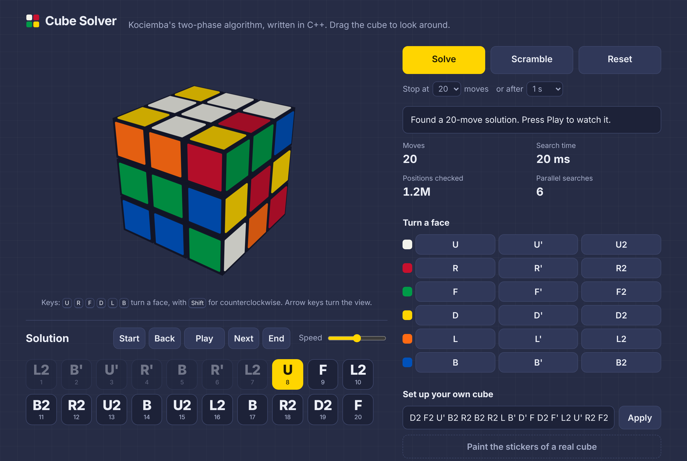

# Cube Solver

A fast 3x3 Rubik's cube solver in C++17. It uses Herbert Kociemba's two-phase algorithm with IDA* search. Six searches run in parallel, and the project comes with a 3D web demo and a JSON API.



## Results

Measured with `cubesolver bench` on 500 uniformly random cubes, on a 2-core cloud machine (Intel Xeon, 2.8 GHz). A modern Mac has more cores, so expect the same or better times there.

| | This project | Starting point ([zer0xor1/RubiksCube](https://github.com/zer0xor1/RubiksCube)) |
|---|---|---|
| Average solution length | **19.5 moves** | 23.1 moves |
| Solutions of 20 moves or fewer | **100 %** | not measured (range was 20 to 26) |
| Average time per cube | **26 ms** | 717 ms |
| Slowest cube | **292 ms** | 4.4 s |
| 95th percentile time | 51 ms | not measured |

The starting point was measured on 50 cubes, on the same machine, with its own solver code. Full numbers and how to reproduce them: [docs/BENCHMARKS.md](docs/BENCHMARKS.md).

## Features

- **Two-phase solver.** Phase 1 reaches the subgroup `<U, D, R2, L2, F2, B2>`. Phase 2 solves inside it. Both phases use IDA* with pruning tables built by breadth-first search.
- **Keeps improving.** After the first solution, the search continues and returns the shortest solution it finds before the time limit. Short scrambles finish the whole search, so they get the shortest possible answer (`R` is solved by `R'`).
- **Parallel search.** Six searches (3 cube rotations, each for the cube and its inverse) share the best length found so far. On 2 cores this cut the average time from 158 ms to 26 ms.
- **Fast start-up.** About 12 MB of tables are built in 0.25 to 0.4 s, using backward breadth-first search for the late layers and five threads in parallel.
- **Web demo.** A 3D cube drawn on a canvas (no libraries). Scramble, solve, play the solution move by move, or paint the stickers of your own cube.
- **JSON API.** `GET /api/solve`, `/api/scramble`, `/api/stats` and `/api/health`, with an LRU cache, a limit on concurrent solves (503 when overloaded), and clear 400 errors for bad input.
- **Tested.** 39 test cases with 35,000+ checks, plus a test that the JavaScript cube model matches the C++ one. Clean under AddressSanitizer, UBSan and ThreadSanitizer. GitHub Actions CI for Linux and macOS.

## Quick start (macOS + VS Code)

You need the Xcode command line tools and CMake 3.21 or newer.

```bash
xcode-select --install     # C++ compiler (skip if already installed)
brew install cmake         # needs Homebrew from https://brew.sh
```

Then:

1. Unzip the project and open the folder in VS Code (**File > Open Folder**).
2. Install the recommended extensions when VS Code asks (C/C++, CMake Tools, CodeLLDB).
3. If CMake Tools asks for a configure preset, choose **Release (fast)**.
4. Press **Cmd+Shift+B** to build.
5. Open the VS Code terminal (**Ctrl+`**) and start the web demo:

```bash
./build/cubesolver_server
```

6. Open **http://localhost:8080** in your browser.

The same steps in a plain terminal:

```bash
cmake --preset release
cmake --build --preset release -j
ctest --preset release            # run all tests
./build/cubesolver_server         # web demo on http://localhost:8080
```

A detailed walkthrough, including debugging and common problems, is in [docs/STEP_BY_STEP.md](docs/STEP_BY_STEP.md).

## Command line

```bash
./build/cubesolver solve "R U F' D2 L B' R2 U' F D L2 B"
./build/cubesolver solve --facelets FRFFUBBUBDRDLRRFFFLRRFFBBLRUUUBDLUDLLDDDLURULRFUDBBDLB
./build/cubesolver solve --facelets UBULURUFURURFRBRDRFUFLFRFDFDFDLDRDBDLULBLFLDLBUBRBLBDB --timeout 3000   # superflip, the hardest case
./build/cubesolver scramble --count 5
./build/cubesolver bench --count 200
./build/cubesolver --help
```

Example output:

```text
Building tables... done in 328 ms
Solution (12 moves): B' L2 D' F' U R2 B L' D2 F U' R'
Time: 20.4 ms | nodes: 1864979 | parallel searches: 6
```

Useful options: `--target N` (good-enough length, default 20), `--timeout MS` (default 1000), `--threads N` (1 to 6, default 6).

## HTTP API

Start the server with `./build/cubesolver_server` (options: `--port`, `--host`, `--web-dir`, `--data-file`). The `PORT` and `CUBESOLVER_DATA_FILE` environment variables work too, and `UPSTASH_REDIS_REST_URL` with `UPSTASH_REDIS_REST_TOKEN` saves the counts to Upstash (see below). Upstash needs HTTPS, so the build uses OpenSSL 3 when it finds it (`brew install openssl@3` on macOS, `libssl-dev` on Linux).

| Request | Returns |
|---|---|
| `GET /api/solve?scramble=R%20U%20R'%20U'` | solution for the cube this scramble makes |
| `GET /api/solve?facelets=<54 letters>&target=20&timeout=1000` | solution for a sticker string |
| `GET /api/scramble` | a random-state scramble and its sticker string |
| `GET /api/stats` | request counts, cache hits, average solve time |
| `GET /api/health` | `{"status":"ok", ...}` |
| `POST /api/visit` | counts a new visitor, returns the counters below |
| `GET /api/counters` | `{"visitors":12,"cubesSolved":40}` for the web page |

```bash
curl "http://localhost:8080/api/solve?scramble=R%20U%20R'%20U'"
```

```json
{"solution":"U R U' R'","length":4,"moves":["U","R","U'","R'"],
 "facelets":"UULUUFUUFRRUBRRURRFFDFFUFFFDDRDDDDDDBLLLLLLLLBRRBBBBBB",
 "timeMs":0.43,"nodes":3436,"searches":6,"targetReached":true,"cached":false}
```

Bad input gets status 400 and a message, for example `{"error":"color R appears 10 times, expected 9"}`. If all four solve slots stay busy for 5 seconds, the server answers 503 instead of making requests wait forever.

Each address may make 15 solves or scrambles at once, then 30 a minute. Past that, the server answers 429 with a `Retry-After` header. Visits are limited the same way (5 at once, then 10 an hour); extra visits are answered but not counted. Behind a hosting proxy, the address comes from `X-Forwarded-For`. A client can fake that header, so the limit stops accidents and casual abuse, not a determined attacker.

The sticker string lists the faces in the order U, R, F, D, L, B, nine stickers each, read row by row. Each letter names the face whose center has that color. See [include/cubesolver/facelet.hpp](include/cubesolver/facelet.hpp) for the exact layout.

## Put it on the internet

The repository has a `Dockerfile`. It builds the server and serves the web demo on the port in `PORT`.

```bash
docker build -t cubesolver .
docker run -p 8080:8080 -v cubesolver-data:/data cubesolver   # then open http://localhost:8080
```

**Render (free):** push the project to GitHub. On render.com, choose **New > Web Service**, pick the repository, pick **Docker**, and set the health check path to `/api/health`. Render finds the Dockerfile and sets `PORT`.

**Keep the counts on Render's free plan.** The free plan has no disk, so counts saved to a file are lost on every deploy. Save them in a free Upstash Redis database instead:

1. Sign up at upstash.com and create a **Redis** database (the free plan is enough; pick the region closest to your Render region).
2. On the database page, find the **REST API** section. Copy `UPSTASH_REDIS_REST_URL` and `UPSTASH_REDIS_REST_TOKEN`.
3. In Render, open your service, then **Environment**, and add both as environment variables with those exact names.
4. Save. Render deploys again. The log should say `Saving visitor and solve counts to Upstash Redis at https://...`.

The server keeps the counts in memory and sends changes to Upstash at most every 15 seconds, and once more when it stops. That stays well inside the free plan's limits.

**Keep the free server awake (optional).** Render stops a free server after 15 minutes without visitors. The next visitor then waits about a minute; the page shows a "Waking up the server" message while it waits. To avoid the wait, have a free monitor such as UptimeRobot open `https://<your-site>/api/health` every 5 minutes. One always-on free service fits in Render's 750 free hours a month.

**Fly.io:** run `fly launch` in the project folder, then `fly volumes create data --size 1` and mount it at `/data` in `fly.toml` (`[mounts] source = "data"`, `destination = "/data"`). The counts then survive restarts.

**Sharing.** The address bar always holds the current cube (`#scramble=R+U+F2` or `#cube=<54 letters>`), and **Copy a link to this cube** copies it. Shared links show a preview card (title, text and `web/og-image.png`) in chat apps and social sites; the server fills in the site's address in the page, because previews need a full image URL.

The visitor count counts each browser once. Someone who clears their browser data counts again.

## How it works

1. **Cube model.** A cube state is four small arrays: which corner and edge sits in each slot, and how each is twisted or flipped. A move is itself a cube state, so applying a move is one multiplication.
2. **Coordinates.** The search works on small integers (for example "corner twist", 0 to 2186) instead of whole cubes.
3. **Move tables** give the new coordinate after each of the 18 moves, so a search step is a few array lookups.
4. **Pruning tables** store, for pairs of coordinates, the exact number of moves needed to fix that part of the cube. This is a lower bound on the real distance, so IDA* can safely cut branches.
5. **Two-phase IDA\*** finds a solution in about 20 moves. It keeps searching with longer phase-1 paths to find shorter totals.
6. **Parallel search** runs the same algorithm on rotated and inverted copies of the cube, which explore different parts of the search space.

More detail, with the design decisions and trade-offs: [docs/DESIGN.md](docs/DESIGN.md).

## Project layout

```text
include/cubesolver/   public headers: cubie.hpp, facelet.hpp, coord.hpp, tables.hpp, solver.hpp
src/core/             the solver library
src/cli/              the cubesolver command-line tool
src/server/           HTTP server, JSON API, LRU cache
web/                  the 3D web demo (HTML, CSS, JavaScript; no build step)
tests/                unit and integration tests (doctest)
tools/                check_web_model.mjs: checks the JS cube model against C++
docs/                 guide, design notes, benchmarks, interview prep
third_party/          doctest and cpp-httplib (single headers, MIT license)
```

## Testing

```bash
ctest --preset release                                   # unit tests + JS model check
cmake --preset asan && cmake --build --preset asan -j && ctest --preset asan   # memory errors
cmake --preset tsan && cmake --build --preset tsan -j && ctest --preset tsan   # data races
```

The tests check known facts about the cube (for example, repeating `R U` 105 times returns to solved), compare sticker strings with Herbert Kociemba's reference implementation, test every coordinate value, check that the pruning tables never overestimate, solve random cubes, and run the HTTP server end to end.

## Credits

- The two-phase algorithm is by Herbert Kociemba. This code is a fresh implementation; its move tables and sticker numbering follow his published conventions.
- The project started from [zer0xor1/RubiksCube](https://github.com/zer0xor1/RubiksCube) (a fork of miskcoo/rubik-cube, MIT license) as a reference.
- [doctest](https://github.com/doctest/doctest) and [cpp-httplib](https://github.com/yhirose/cpp-httplib), both MIT licensed, are included in `third_party/`.

## License

MIT. See [LICENSE](LICENSE).
